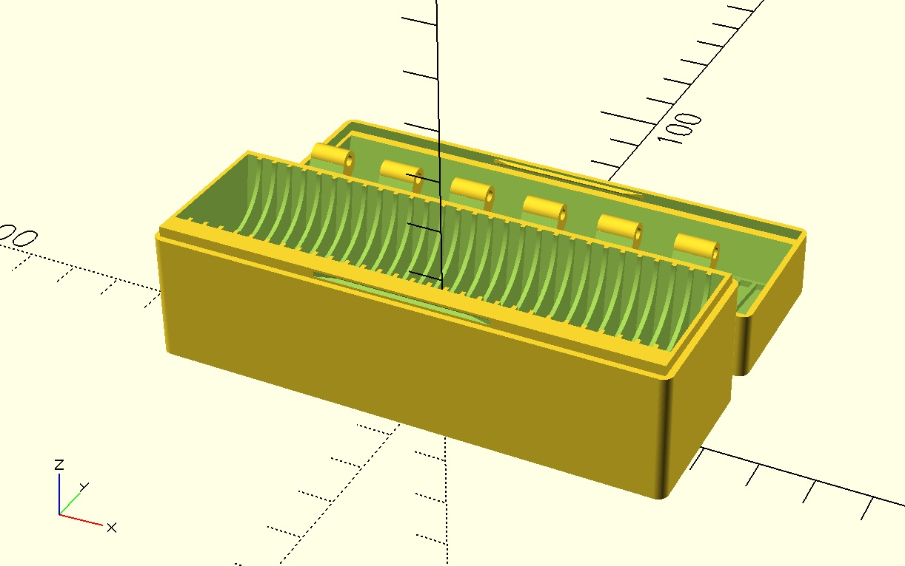
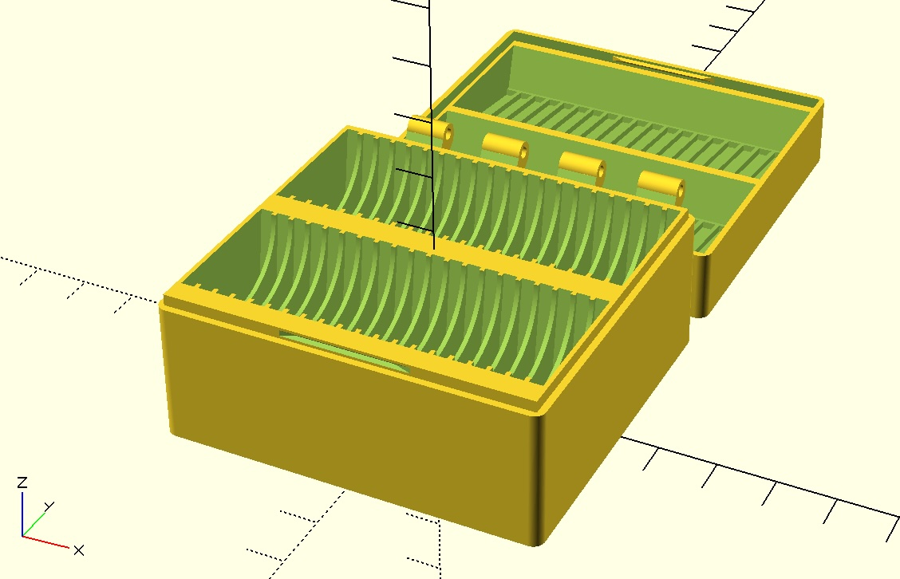
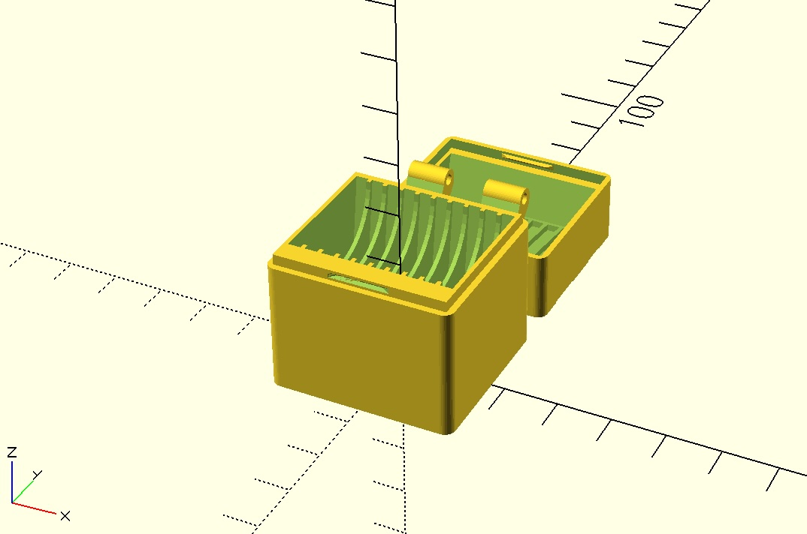

# SD Card Box
Design for a parametric case to carry (many) SD cards. Intended for FDM 3D printing.

**License:** [CC BY-SA 4.0](http://creativecommons.org/licenses/by-sa/4.0/)  
**Author:** Ken Werner

## Overview
The case consist of base with plus a snap-locking lid, printed as two parts on a shared hinge pin. Each card sits in its own tilted slot, angled toward the hinge so it stands at the same angle the lid needs when it swings shut. The two parts can be printed without support. A piece of 1.75 mm Filament can be used to connect the hinges.

## Requirements
- [OpenSCAD](https://openscad.org/)
- [BOSL2](https://github.com/BelfrySCAD/BOSL2) library

## Usage
Open `sd-card-box.scad` in OpenSCAD. The preview shows the base and the lid (with engraved text) side by side. To export a part for printing, comment out the one you don't need and export as STL (F6 to render, then File -> Export -> STL or 3mf).

### Key parameters
| Parameter | Default | Description |
|---|---|---|
| `num_sd_slots_per_row` | 30 | Slots per row, stacked along the hinge axis |
| `num_sd_slot_rows` | 1 | Rows stacked in the depth direction |
| `spacing` | 0.8 mm | Gap between slots |
| `sd_clearance` | 0.28 mm | Extra room added to each slot so a card drops in freely |
| `card_tilt` | 8°| Angle slots (and the lid pockets) lean toward the hinge |
| `wall_thickness` | 1.2 mm | Outer shell and lid thickness |
| `lid_catch_depth` | 1.2 mm | How deep the lid's per-card pockets grip the card tip |
| `lock_height` / `lock_socket_clearance` | 0.4 mm / 1.05 | Snap-lock ridge height and socket oversize |
| `hinge_offset` / `hinge_pin_raise` | 3 mm / 2 mm | Hinge pin position relative to the shell |
| `case_text1` / `case_text2` | card count / free text | Text engraved into the lid |

## Printing Notes
- Print both the base and the lid as oriented in the preview (open side up). No supports needed as the hinge knuckles use a teardrop profile so they print bridge-free.
- If the lid snaps too tight or too loose, adjust `lock_height` or `lock_socket_clearance`.
- If cards are hard to insert or fall out too easily, adjust `sd_clearance`.
